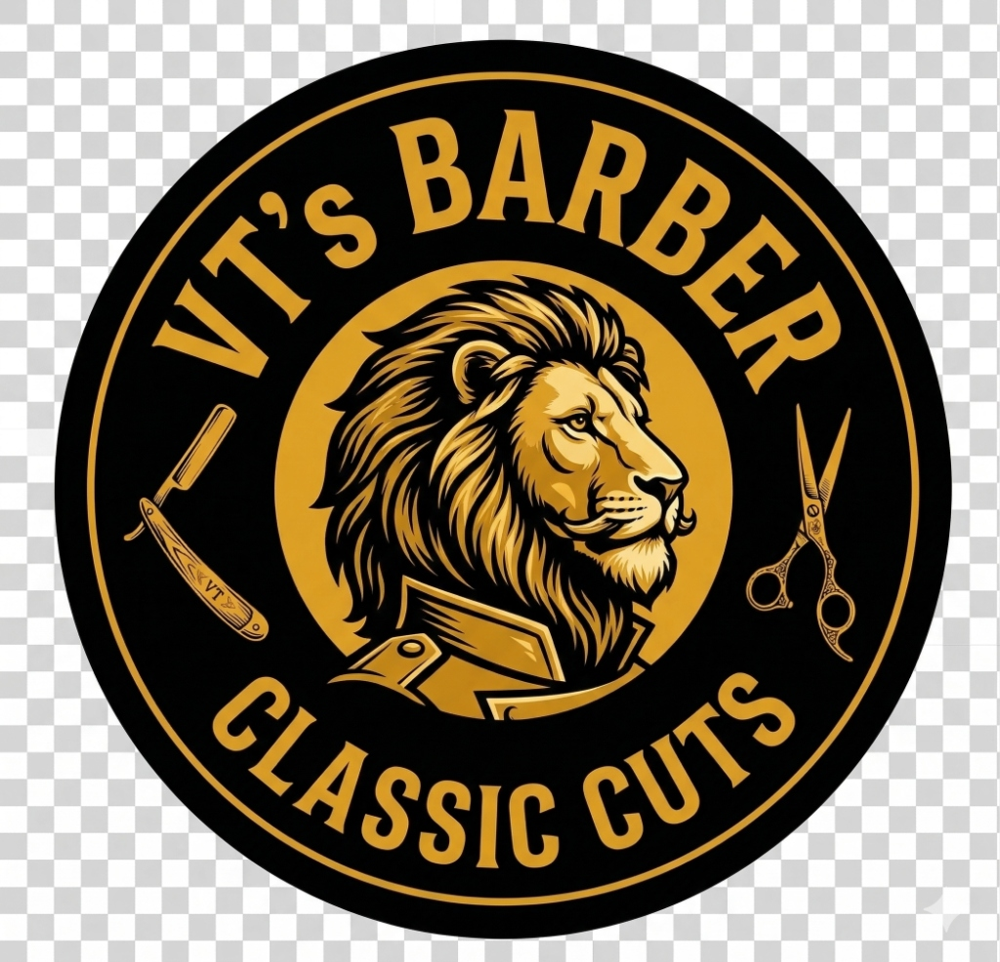

# VT'S Barber



**VT'S Barber** é uma aplicação web moderna de agendamento e vitrine de serviços para uma barbearia com foco em **Alto Padrão**. Desenvolvido com **Next.js (App Router)** e focado em um design escuro OLED com tons metálicos (dourado, prata, bronze), o projeto explora interfaces atraentes de alta conversão, interações *glassmorphic* ultra-fluidas e animações de scroll avançadas.

---

## 🚀 Tecnologias Integradas

- **Front-end:** [Next.js v15](https://nextjs.org/) utilizando App Router, TypeScript e React.
- **Estilização UI:** CSS Modules puros estruturados para performance rápida e animações de hardware-acceleration (sem Tailwind).
- **Ícones Animados:** Lucide React (`lucide-react`)
- **Gestão Global de Cores:** Design System base implementado em `globals.css` focado no ecossistema Dark-Gold.

---

## 🎨 Referências de Design e Inspiração 

Durante toda a confecção da identidade visual, animações e fluxos de tela, as seguintes referências foram fundamentais para conceber o aspecto Premium do sistema:

### 1. Elementos Visuais e Atmosfera de Vídeo
- **Aesthetic Cinematográfico (Backstage Barbershop):** 
  Utilizamos como inspiração o "B-roll" de barbearias de alto nível (YouTube Shorts por @fabricioblasi).
  *Referência:* [Backstage Barbershop - Video Barbearia](https://www.youtube.com/shorts/n4UP1fe9iCg)

### 2. Painel Principal, Clubes e Feedbacks
- **Don Maestro Barber Shop:** 
  Inspirou fortemente a estruturação de seções (Aba 'Nossa História', a distribuição do Painel e nosso conceito de Rolagem de Testemunhos por Carrossel Múltiplo).
  *Referência:* [Don Maestro Barber Shop](https://barbeariadonmaestro.com.br/)

### 3. Sistema de Assinaturas (Pricing Cards)
- **CodePen Pricing Table (drehimself):**
  Definiu as lógicas estruturais das nossas vitrines de Planos/Clubes. As seções "Corte Club", "Barba Club" e "Combo Club" receberam tratativas modulares para cores (Bronze, Prata, Ouro) através dessa fundação elegante.
  *Referência:* [Pricing Table - Andre Madarang](https://codepen.io/drehimself/pen/QNXpyp)

### 4. Cardápio Completo de Serviços Exclusivos
- **Artesanos Barber Shop:** 
  Adotamos deles o layout tipográfico em estilo "Menu de Taberna/Restaurante" para a página expandida de `/servicos`. O visual que amarra o Nome do Serviço ao Preço usando linhas pontilhadas dinâmicas (CSS Flex Dotted-leader) proveio desse portal.
  *Referência:* [Artesanos Barber Shop](https://www.artesanosbarbershop.com.br/)

### 5. Coleta de Depoimentos Reais
- **Giga Barber (Duque de Caxias):**
  Usamos as vitrines genuínas de feedbacks capturadas diretamente da região do Google Maps para moldar o carrossel de 5 Estrelas, destacando uma UX extremamente verossímil.
  *Referência:* [Giga Barber - Google Maps](https://www.google.com/maps/place/Barbearia+Giga+Barber+%7C+Olavo+Bilac+-+Duque+de+Caxias/@-22.7612388,-43.35801,14z/data=!4m10!1m2!2m1!1sbarbearia+duque+de+caxias!3m6!1s0x99712eb04ca3e1:0xd1c6364086aab34!8m2!3d-22.7612388!4d-43.3199012!15sChliYXJiZWFyaWEgZHVxdWUgZGUgY2F4aWFzkgELYmFyYmVyX3Nob3DgAQA!16s%2Fg%2F11w8rjpy_k?entry=ttu&g_ep=EgoyMDI2MDQwNy4wIKXMDSoASAFQAw%3D%3D)

---

## 📦 Como rodar localmente

Este projeto foi inicializado através de `create-next-app`.

1. Instale todas as pendências da raiz:
```bash
npm install
```

2. Roda o script de desenvolvimento:
```bash
npm run dev
```

Estará rodando limpo e magicamente exposto no porto [3000 (ou o primeiro disponível)](http://localhost:3000) com scroll suavemente animado e todos os assets na ponta do navegador!
